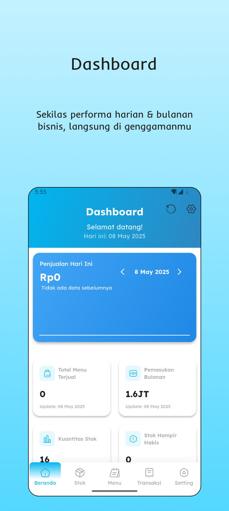
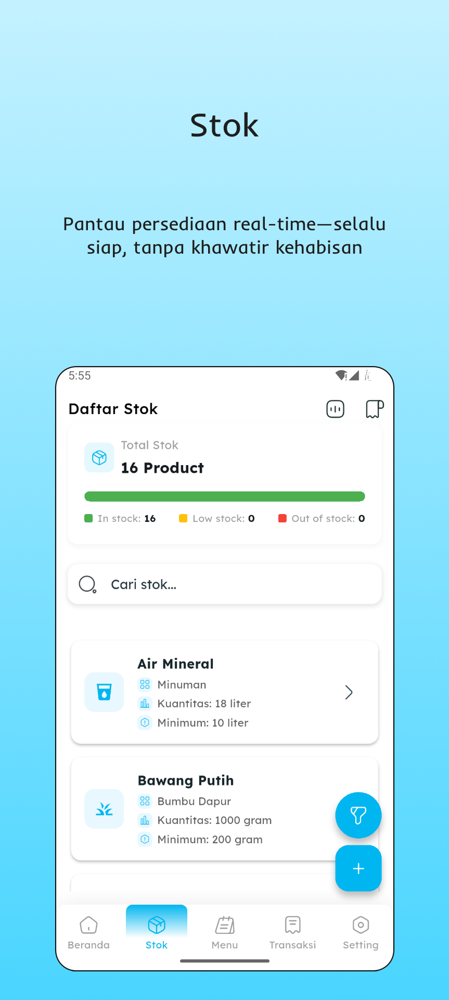
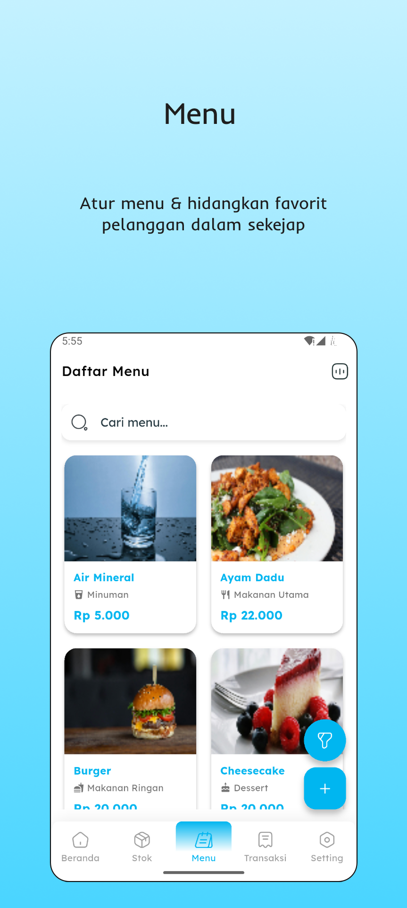
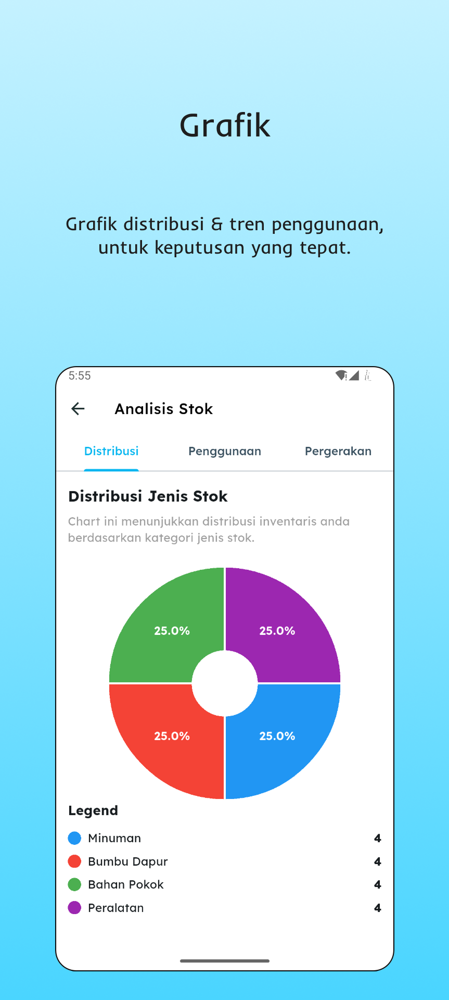

<h1 align="center">
  
 &nbsp TheDjenggot
</h1>

Proyek ini merupakan tugas mata kuliah Rekayasa Perangkat Lunak (RPL)
di semester 4, Institut Pertanian Bogor (IPB).

## Team Members

| Name                            | NIM         |
| ------------------------------- | ----------- |
| Ludwig Alven Tama Lumban Tobing | G6401231006 |
| Kivi Adelio                     | G6401231047 |
| Jofattan Faiz Betryan           | G6401231066 |
| Jason Bagaskara Mulyono         | G6401231088 |
| Insan Anshary Rasul             | G6401231132 |

## Overview

Proyek ini adalah aplikasi kasir yang dirancang untuk membantu warung makan mencatat
hasil penjualan dan mengelola stok barang. Setiap kali pelanggan membayar, transaksi
akan dicatat oleh aplikasi. Selain itu, aplikasi ini juga memungkinkan pengguna untuk
menambah atau mengurangi data stok sesuai kebutuhan. Terakhir, aplikasi juga menerima
pencatatan pesanan dari WhatsApp.

## Features

- **Pencatatan Penjualan**: Mencatat setiap transaksi penjualan yang dilakukan oleh pelanggan.
- **Manajemen Stok**: Menyimpan data stok barang dan memungkinkan penambahan atau pengurangan stok sesuai kebutuhan.
- **Integrasi WhatsApp & Notifikasi**: 
  - Menerima pesanan melalui WhatsApp yang tersinkronisasi dengan Firebase Firestore
  - Notifikasi real-time untuk pesanan baru dengan badge indicator
  - Manajemen status pesanan (Pending, On Work, Selesai)
- **Firebase Integration**: Sinkronisasi data pesanan online menggunakan Cloud Firestore
- **Push Notifications**: Notifikasi lokal untuk pesanan baru bahkan ketika aplikasi aktif
- **Analisis Keuangan**: Melihat laporan keuntungan dan kerugian untuk membantu pengelolaan keuangan.
- **UI yang Responsif**: Antarmuka pengguna yang mudah digunakan dan ramah pengguna.

## Tech Stack

- **Framework**: Flutter 3.29.2
- **State Management**: Flutter Bloc (v9.1.0)
- **Local Database**: SQLite (sqflite v2.4.2)
- **Cloud Database**: Firebase Firestore (v5.6.8)
- **Backend Services**: Firebase Core (v3.13.1)
- **Notifications**: Flutter Local Notifications
- **Navigation**: GoRouter (v14.8.1)
- **Charts & Visualization**: FL Chart (v0.64.0)
- **UI Components**: Custom widgets with Lexend font family

## Prerequisites

- Flutter SDK: 3.29.2
- Dart: 3.7.2
- Android Studio / VS Code with Flutter plugins
- Firebase project setup (for WhatsApp integration and notifications)
- WhatsApp Business API access (optional, for full WhatsApp integration)

## Installation

1. **Clone the repository**:
   ```sh
   git clone <repository-url>
   cd the_djenggot
   ```

2. **Firebase Setup**:
   - Create a new Firebase project at [Firebase Console](https://console.firebase.google.com/)
   - Enable Firestore Database
   - Download `google-services.json` and place it in `android/app/`
   - Update Firebase configuration in `lib/firebase_options.dart`

3. **Install dependencies** 
    ```sh
    flutter pub get
    ```

4. **Run the app**
    ```sh
    flutter run
    ```

5. **WhatsApp Integration** (Optional):
   - Set up your WhatsApp bot to send order data to your Firestore collection
   - Orders should be stored in the `orders` collection with the following structure:
     ```json
     {
       "nama": "Customer Name",
       "phoneNumber": "+1234567890",
       "makanan": "Order Items",
       "pembayaran": "Payment Method",
       "status": "Pending",
       "timestamp": "2025-01-01T00:00:00Z"
     }
     ```

## Screenshots

<table>
  <tr>
    <td></td>
    <td></td>
    <td></td>
    <td></td>
  </tr>
</table>

## Project Structure

```
lib/
  ├── bloc/            # State management with Flutter Bloc
  ├── database/        # Local database operations with SQLite
  ├── models/          # Data models for the application
  ├── repository/      # Repository pattern implementation
  ├── routing/         # App navigation with GoRouter
  ├── screens/         # UI screens of the application
  ├── services/        # External services integration
  ├── utils/           # Helper functions and utilities
  ├── widgets/         # Reusable UI components
  └── main.dart        # Entry point of the application
```

## Dependencies

### Core Dependencies
- **State Management**: flutter_bloc
- **Navigation**: go_router
- **Local Database**: sqflite
- **Cloud Database**: cloud_firestore
- **Firebase**: firebase_core
- **Notifications**: flutter_local_notifications

### UI & UX
- **Icons**: iconsax
- **Speed Dial**: flutter_speed_dial
- **Charts**: fl_chart

### Utilities
- **Data Handling**: equatable, intl, uuid
- **File Operations**: image_picker, path_provider, file_picker
- **Permissions**: permission_handler
- **External Communication**: url_launcher, share_plus

## Development Mode

Aplikasi ini menyediakaan dummy data untuk development. Untuk menggunakannya pastikan pada line ini tidak di-comment di pubspec.yaml
```yaml
# Comment this if you want release mode
- assets/dummy_images/
```

## Firebase Configuration

For WhatsApp integration and notifications to work properly:

1. **Firestore Database Structure**:
   ```
   orders/ (collection)
   ├── document_id/
   │   ├── nama: string
   │   ├── phoneNumber: string
   │   ├── makanan: string
   │   ├── pembayaran: string
   │   ├── status: string ("Pending", "On work", "Selesai!")
   │   └── timestamp: timestamp
   ```

2. **Firestore Security Rules** (Example):
   ```javascript
   rules_version = '2';
   service cloud.firestore {
     match /databases/{database}/documents {
       match /orders/{document} {
         allow read, write: if true; 
       }
     }
   }
   ```

3. **Notification Features**:
   - Real-time badge indicator on the notification icon
   - Local notifications when new orders are added to Firestore
   - Order status management with visual feedback

## Known Limitations

- Local notification hanya berfungsi jika aplikasinya berjalan (foreground/background)
- Jika aplikasi tertutup sepenuhnya, Firebase Cloud Messaging (FCM) dibutuhkan
- Integrasi WhatsApp bot harus dibuat sendiri. Untuk projek ini silahkan mengacu kepada https://github.com/insanansharyrasul/the-djenggot-wweb-bot
  

## Contact

For questions or feedback, please contact the project maintainers.
Untuk pertanyaan atau feedback, silahkan kontak project mantainer.

---

© 2025 TheDjenggot Team | Made with ❤️ at Institut Pertanian Bogor
